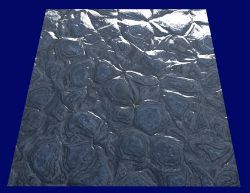

# Normal mapping

[Normal mapping](https://en.wikipedia.org/wiki/Normal_mapping) is a technique aims to fake a high-accuracy surface on a low-accuracy mesh.
It uses a 2D texture (a lookup table) to record surface normals for a mesh.
Each point on the surface of the mesh has a corresponding normal in the table.
When computing the color for a fragment,
we use the normal from the table instead of the interpolated vertex normal.
As a result, we get a fake smooth surface with relatively low cost.

# Note

## A common mistake when computing normals

I have used the following code to compute normals:

```
normal = texture(normalMap, TexCoords).rgb;
normal = normalize(normal * 2.0 - 1.0);
```

and it produced an incorrect result.
It ignored the fact that normal maps are defined in tangent space.
Before using, we should transform them from tangent space to world space.

Check [this article](https://learnopengl.com/Advanced-Lighting/Normal-Mapping) to find more information about normal mapping and tangent space.
The corresponding code for computing normals can be found [here](https://github.com/JoeyDeVries/LearnOpenGL/blob/master/src/6.pbr/1.2.lighting_textured/1.2.pbr.fs).

## Using halfway vector

When computing specular, using `dot(H, N)` instead of `dot(R, V)` can obtain better result.
`H` is called halfway vector and `H = normalize(L, V)`.
Here, `N, R, V, L` denotes normal, reflect, view and light vector, respectively.

# Result

