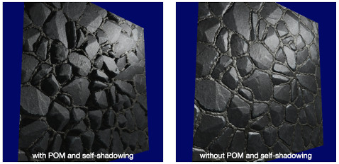
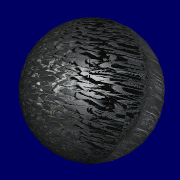

# Normal mapping

[Normal mapping](https://en.wikipedia.org/wiki/Normal_mapping) is a technique aims to fake a high-accuracy surface on a low-accuracy mesh.
It uses a 2D texture (a lookup table) to record surface normals for a mesh.
Each point on the surface of the mesh has a corresponding normal in the table.
When computing the color for a fragment,
we use the normal from the table instead of the interpolated vertex normal.
As a result, we get a fake smooth surface with relatively low cost.

# Note

## A common mistake when computing normals

I have used the following code to compute normals:

```
normal = texture(normalMap, TexCoords).rgb;
normal = normalize(normal * 2.0 - 1.0);
```

and it produced an incorrect result.
It ignored the fact that normal maps are defined in tangent space.
Before using, we should transform them from tangent space to world space.

Check [this article](https://learnopengl.com/Advanced-Lighting/Normal-Mapping) to find more information about normal mapping and tangent space.
The corresponding code for computing normals can be found [here](https://github.com/JoeyDeVries/LearnOpenGL/blob/master/src/6.pbr/1.2.lighting_textured/1.2.pbr.fs).

## Computing normals

In the mentioned article, they use the following code to compute normals in fragment shader.

```
// from https://github.com/JoeyDeVries/LearnOpenGL
vec3 getNormalFromMap()
{
    vec3 tangentNormal = texture(texNormal, uv).xyz * 2.0 - 1.0;

    vec3 Q1  = dFdx(worldPos);
    vec3 Q2  = dFdy(worldPos);
    vec2 st1 = dFdx(uv);
    vec2 st2 = dFdy(uv);

    vec3 n   = normalize(worldN);
    vec3 t  = normalize(Q1*st2.t - Q2*st1.t);
    vec3 b  = -normalize(cross(n, t));
    mat3 tbn = mat3(t, b, n);

    return normalize(tbn * tangentNormal);
}
```
Each component of a normal which is sampled from a normal map should be transform to `[-1, 1]` before being used.

`dFdx(.)` and `dFdy(.)` are GLSL functions which can only be used in fragment shader.

For a certain variable `p` at fragment `(x, y)` in the window space,
`dFdx(p(x, y))` returns `p(x+1, y) - p(x, y)`,
and `dFdy(p(x, y))` returns `p(x, y+1) - p(x, y)`.
This makes `Q1, Q2` be the two edges and `st1, st2` be the difference of the texture coordinate in the mentioned article.

The code for computing tangent vector `t` is based on the following fact:


Finally, `tbn * tangentNormal` transforms the normal from tangent space to world (or model) space.  

## Using halfway vector

When computing specular, using `dot(H, N)` instead of `dot(R, V)` can obtain better result.
`H` is called halfway vector and `H = normalize(L + V)`.
Here, `N, R, V, L` denotes normal, reflect, view and light vector, respectively.

# Parallax Occlusion Mapping (POM)

Aims to generate faked stereoscopic effect without adding extra vertices.

You can refer to [this article](https://learnopengl.com/Advanced-Lighting/Parallax-Mapping) to get more details, and [here](https://github.com/JoeyDeVries/LearnOpenGL/tree/master/src/5.advanced_lighting/5.3.parallax_occlusion_mapping) is the original code.

Note that if you want to compute TBN matrix in fragment shader,
you can try the following [code](https://github.com/JoeyDeVries/LearnOpenGL/tree/master/src/5.advanced_lighting/4.normal_mapping):

```
mat3 computeTBN(vec2 tempUv){
    vec3 Q1  = dFdx(worldPos);
    vec3 Q2  = dFdy(worldPos);
    vec2 st1 = dFdx(tempUv);
    vec2 st2 = dFdy(tempUv);

    vec3 n   = normalize(worldN);
    vec3 t  = normalize(Q1*st2.t - Q2*st1.t);

    // in the normal mapping tutorial,
    // they use vec3 b = -normalize(cross(n, t))
    // but it generates weird result
    // vec3 b  = normalize(cross(n, t));

    // or directly compute from the equation
    vec3 b = normalize(-Q1*st2.s + Q2*st1.s);

    mat3 tbn = mat3(t, b, n);

    return tbn;
}
```

## Self-shadowing

Essentially, it is an inverse of POM (refer to [1] for more information).

Start from the intersection point `B` found in POM,
go along the `B` to light direction with some fixed step,
find whether there is an intersection `C` at the distorted surface.


```
float shadowFactor = hasIntersection ? 0.0 : 1.0;
finalColor = ambient + (diffuse + specular) * shadowFactor;
```

The above code results in a hard shadow.
You can refer to [this thread](https://stackoverflow.com/questions/55089830/adding-shadows-to-parallax-occlusion-map) to find more details.

[1] provides a method to compute soft shadow,
but it is for an area light source.
[piellardj](https://github.com/piellardj/parallax-mapping/blob/master/shaders/parallax.frag)
has modified it to handle a point light source:

1. Set the `shadowFactor` to `1.0`.

2. During each iteration,
compute the difference of depth value `ΔD = currentLayerDepth - currentDepthMapValue`.
Here, `currentLayerDepth` and `currentDepthMapValue` correspond to the green and blue point, respectively.

3. Compute an attenuation ratio `atten = ΔD / ΔL`, then `shadowFactor -= atten`.

4. After all the iterations, `atten = max(atten, 0.0)` to avoid a negative value.


Intuitively, each `shadowFactor -= atten` represents one obstacle.
More obstacles result in more shadows.
With this algorithm, we can obtain a gradient of shadow (i.e. the soft shadow).

# Result

Normal mapping with parallax occlusion mapping and self-shadowing.




As shown in the image,
we can obtain some faked stereoscopic effect with POM and self-shadowing.

# Limitation and problem

## Restricted view direction

When the view direction moves from parallel (left) to nearly perpendicular (right) to the surface normal, artifacts gradually appear.


## Not suitable for non-quad surface

This is pointed out in the tutorial.



## Performance

Currently, I use `minLayers = 8, maxLayers = 32` for POM and self-shadowing.
With this configuration, if I use more than `3x3` quads, I will get a very low `FPS`.
Although decreasing `minLayers` and `maxLayers` may somewhat improve performance,
more artifacts will appear.

# Reference

[1] Tatarchuk, Natalya. "Dynamic parallax occlusion mapping with approximate soft shadows." Proceedings of the 2006 symposium on Interactive 3D graphics and games. 2006.
